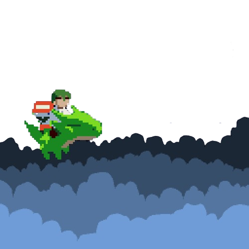

<div id="readme-top"></div>

<div align="center">
  <a href="https://github.com/boyandmtrv/GoblinKeys-1.0">
    
  </a>

  <h1 align="center">Goblin Keys 1.0</h1>

  <p align="center">
    Master your typing skills
    <br />
    <a href="https://github.com/boyandmtrv/GoblinKeys-1.0"><strong>Discover the docs</strong></a>
  </p>
</div>

<details>
  <summary>Table of Contents</summary>
  <ol>
    <li>
      <a href="#about-the-project">About The Project</a>
        <li><a href="#built-with">Built With</a></li>
    </li>
        <li><a href="#installation">Installation</a></li>
    <li><a href="#usage">Usage</a></li>
    <li><a href="#license">License</a></li>
    <li><a href="#contact">Contact</a></li>
  </ol>
</details>

## About The Project


GoblinKeys 1.0 stands as a unique and retro-inspired React application, meticulously designed to serve as both a platform for refining your typing skills and a creative outlet for crafting custom typing games. Whether you're looking to enhance your speed and accuracy or engage in a community-driven gaming experience, GoblinKeys 1.0 has you covered.

Why GoblinKeys 1.0?
* Gameplay Dynamics:
  * Personalized Options: Tailor your gameplay with customizable settings, from duration to sentence generation and difficulty levels.
  * Immersive Typing: Immerse yourself in the typing experience with highlighted words, real-time error feedback, and a       visible cursor guiding you through each keystroke.
* Test Results and Interaction:
  * Comprehensive Feedback: After each test, receive detailed results including correct and incorrect words, accuracy           percentage, and words per minute calculation.
  * User-Centric Messages: Personalized messages based on your accuracy rate guide you toward improvement and encourage       ongoing skill development.
  * Refresh or Retake: Choose to refresh the test for a new set of words or retake it to further refine your typing           abilities.
* Features:
  * Personalized Welcome: Enjoy a warm greeting on the Welcome Page upon every login, setting the tone for an engaging user   experience.
  * Master the Main Game: Dive into the main typing game, with unlimited plays available for users to sharpen their typing      prowess.
  * Craft Your Game: Unleash your creativity by designing custom games. Define the text, toggle random sentence or quote        generation, set difficulty levels, and determine time constraints.
  * Fine-Tune Your Creations: Test and edit your own games, or opt to remove them entirely. The power to shape and refine       your creations is in your hands.
  * Community Engagement: Explore and test unlimited games crafted by fellow users, fostering a sense of community within       the GoblinKeys environment. <br />
  
Embark on your typing journey with GoblinKeys 1.0, where skill-building and creativity converge in a user-centric and retro-themed environment.

<p align="right">(<a href="#readme-top">back to top</a>)</p>

### Built With
[](https://react.dev/) <br/>
[](https://reactrouter.com/) <br/>
[](https://github.com/lukePeavey/quotable) <br />
[](https://www.npmjs.com/package/random-words) <br />
[](https://tailwindcss.com/) <br/>
[](https://www.npmjs.com/package/tailwind-scrollbar) <br />
[](https://react-icons.github.io/react-icons/) <br />
[](https://www.npmjs.com/package/lucide-react) <br />
[](https://www.npmjs.com/package/react-simple-typewriter) <br />
[](https://www.npmjs.com/package/react-spring) <br />
[](https://www.npmjs.com/package/react-toastify) <br />
[](https://boxicons.com/) <br />
[](https://vitejs.dev/) <br/>

<p align="right">(<a href="#readme-top">back to top</a>)</p>

## Getting Started

To get a local copy, follow these steps:
  
### Installation

1. Clone the repo
   ```sh
   git clone https://github.com/boyandmtrv/GoblinKeys-1.0.git
   ```
2. Install NPM packages in the client's folder
   ```sh
   cd .\client\
   ```
   ```sh
   npm install
   ```
3. Install NPM packages in the server's folder
   ```sh
   cd .\server\
   ```
   ```sh
   npm install
   ```

<p align="right">(<a href="#readme-top">back to top</a>)</p>

## Usage

### Run the server
1. Open a new terminal and enter the server folder
   ```sh
   cd .\server\
   ```
2. Run the back-end application
   ```sh
   node .\server.js
   ```
   *If eveything is fine you will receive the following message in the terminal:
   Server started on port 3030. You can make requests to http://localhost:3030/*

   Note: <br />
   *If you need to customize the server or client configurations, refer to the respective server.js and client/package.json     files.*


### Run the app
1. Open a new terminal and enter the client folder
   ```sh
    cd .\client\
   ```
2. Run the front-end application
   ```sh
   npm run dev
   ```
   *To open the application locally, enter the following url in the browser field: http://localhost:5173/ or use CTRL + left click in the terminal box*

You can also check out the live version of Huddle by clicking [here](https://goblinkeys.vercel.app/)


<p align="right">(<a href="#readme-top">back to top</a>)</p>

## License

Distributed under the MIT License. See `LICENSE` for more information.

<p align="right">(<a href="#readme-top">back to top</a>)</p>

## Contact

[](https://www.linkedin.com/in/boyan-dimitrov-4402b4179/) <br />
[](mailto:boyandimitrov1462@gmail.com) <br />
[](https://github.com/boyandmtrv) <br />


